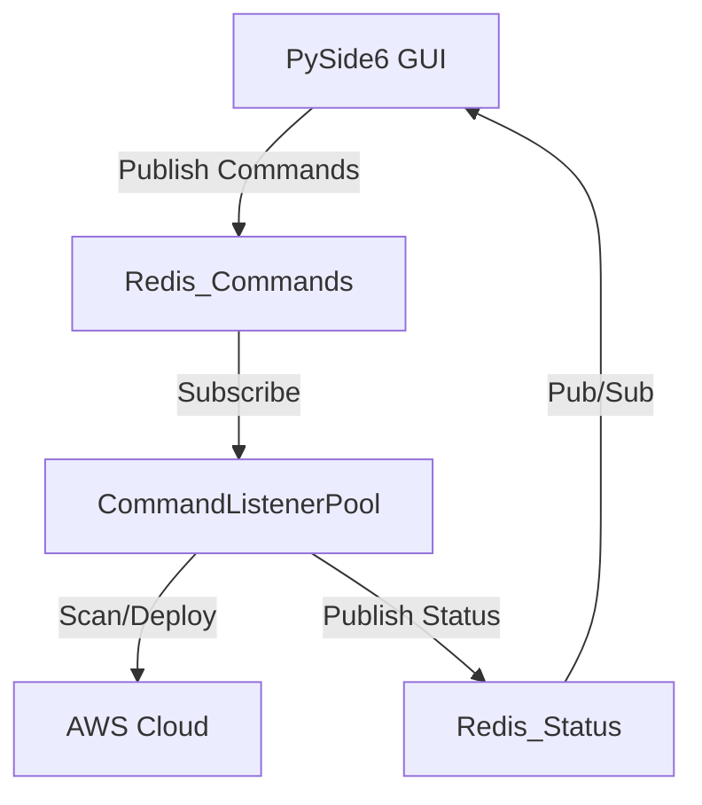

# Pockitect MVP (Event-Driven Edition)

A desktop-first, local-first AWS infrastructure wizard built with PySide6 and Redis pub/sub.

## Features

- **Visual Wizard**: Configure AWS infrastructure (EC2, VPC, RDS, S3) step-by-step.
- **Event-Driven Architecture**: Uses Redis Pub/Sub for real-time UI updates.
- **Background Processing**: Heavy scanning and deployment tasks run in Redis-backed listener threads.
- **Resource Monitor**: View and manage resources across all AWS regions.
- **Local Storage**: Projects saved as YAML blueprints.
- **AI Agent**: Natural language requests for blueprint generation and commands.

## Prerequisites

1. **Python 3.10+**
2. **Redis Server** (Must be running locally)
   ```bash
   sudo apt install redis-server
   sudo service redis-server start
   ```

## Quick Start

### 1. Install Dependencies
```bash
python3 -m venv venv
source venv/bin/activate
pip install -r requirements.txt
```

### 2. Run with Debug Logging (Recommended for Development)
We provide a helper script that starts Redis in the background, redirects its logs to the `logs/` directory, and then launches the app.

```bash
./debug_run.sh
```

**Log Files:**
- `logs/pockitect.log`: Main application logs.
- `logs/redis.log`: Redis server logs (if started by the script).

### Manual Startup (Production-like)

**Run Application:**
```bash
./run.sh
```

## AI Agent

The AI Agent uses Ollama for local LLM inference. Ensure Ollama is running:

```bash
ollama pull llama3.2
ollama serve
```

You can configure the model and host via environment variables:

- `OLLAMA_HOST` (default: `localhost`)
- `OLLAMA_PORT` (default: `11434`)
- `OLLAMA_MODEL` (default: `llama3.2`)

See the detailed guide at `docs/ai_integration.md`.

## Architecture



- **PySide6 GUI**: Responsive interface (`src/main.py` + `src/monitor_tab.py`).
- **Redis**: Message bus (`pockitect:commands`, `pockitect:status`) and cache files.
- **Listeners**: Execute `scan_all_regions`, `deploy`, and `terminate` handlers (`src/app/core/listeners.py`).

## Project Structure

```
src/
├── main.py             # Application entry point
├── monitor_service.py  # Bridge between GUI and Redis status updates
├── app/
│   ├── core/
│   │   ├── aws/        # Async AWS scanners and deployers
│   │   ├── listeners.py # Redis command listener pool
│   │   └── redis_client.py # Redis & PubSub wrapper
├── wizard/             # Infrastructure creation wizard
└── aws/                # Legacy/Sync AWS wrappers (used by wizard/monitor)
```
