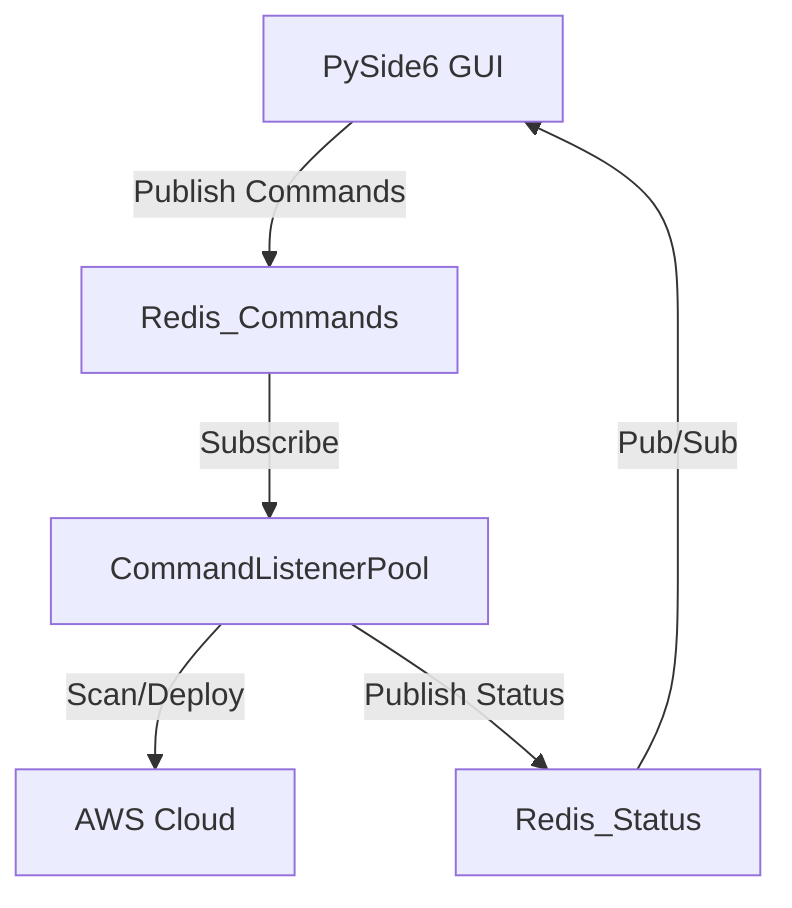

# Pockitect MVP (Event-Driven Edition)

A desktop-first, local-first AWS infrastructure wizard built with PySide6 and Redis pub/sub.

## Features

- **Visual Wizard**: Configure AWS infrastructure (EC2, VPC, RDS, S3) step-by-step.
- **Event-Driven Architecture**: Uses Redis Pub/Sub for real-time UI updates.
- **Background Processing**: Heavy scanning and deployment tasks run in Redis-backed listener threads.
- **Resource Monitor**: View and manage resources across all AWS regions.
- **Local Storage**: Projects saved as YAML blueprints.
- **AI Agent**: Natural language requests for blueprint generation and commands.

## Prerequisites

- **Python 3.10+**
- **Redis Server** (must be running locally)
- **Ollama** (optional, for AI Agent features)
- **Qt5 libraries** (Linux only, for PySide6)

## Installation

### Automated Installation (Recommended)

**On Linux/macOS:**
```bash
chmod +x install.sh
./install.sh
```

**On Windows (PowerShell):**
```powershell
.\install.ps1
```

The installation script will:
- Check and install Python 3.10+ if needed
- Install Redis server and start it
- Install Qt dependencies (Linux only)
- Optionally install Ollama for AI features
- Create a Python virtual environment
- Install all Python dependencies

### Manual Installation

If you prefer to install manually:

1. **Install Python 3.10+**
   - Linux: `sudo apt install python3.10 python3-pip` (Ubuntu/Debian)
   - macOS: `brew install python@3.10`
   - Windows: Download from [python.org](https://www.python.org/downloads/)

2. **Install Redis**
   - Linux: `sudo apt install redis-server && sudo systemctl start redis-server`
   - macOS: `brew install redis && brew services start redis`
   - Windows: Download from [Redis releases](https://github.com/microsoftarchive/redis/releases) or use Chocolatey: `choco install redis-64`

3. **Install Qt dependencies (Linux only)**
   ```bash
   # Ubuntu/Debian
   sudo apt install libxcb-xinerama0 libxcb-cursor0 libxkbcommon-x11-0
   
   # Fedora/RHEL
   sudo dnf install qt5-qtbase-x11 libxkbcommon
   
   # Arch
   sudo pacman -S qt5-base xcb-util libxkbcommon
   ```

4. **Set up Python environment**
   ```bash
   python3 -m venv venv
   source venv/bin/activate  # On Windows: venv\Scripts\activate
   pip install -r requirements.txt
   ```

5. **Install Ollama (optional, for AI features)**
   - Visit [ollama.ai](https://ollama.ai) and follow installation instructions
   - Pull a model: `ollama pull llama3.2`

### 2. Run with Debug Logging (Recommended for Development)
We provide helper scripts that automatically start Redis and Ollama in the background, redirect their logs to the `data/logs/` directory, and then launch the app.

**On Linux/macOS/WSL:**
```bash
./debug_run.sh
```

**On Windows (PowerShell):**
```powershell
.\debug_run.ps1
```

**Log Files:**
- `data/logs/pockitect.log`: Main application logs.
- `data/logs/redis.log`: Redis server logs (if started by the script).
- `data/logs/ollama.log`: Ollama server logs (if started by the script).

**Note:** The scripts will check if Redis and Ollama are already running, and only start them if needed. Ensure Ollama is installed and a model is available (e.g., `ollama pull llama3.2`) for AI Agent features to work.

### Verify Installation

Before running, you can check that all requirements are met:

**On Linux/macOS:**
```bash
./check_requirements.sh
```

**On Windows:**
```powershell
.\check_requirements.ps1
```

### Manual Startup (Production-like)

**On Linux/macOS/WSL:**
```bash
./run.sh
```

**On Windows (PowerShell):**
```powershell
.\run.ps1
```

## AI Agent

The AI Agent uses Ollama for local LLM inference. 

**Quick Setup:**
1. Install Ollama from https://ollama.ai
2. Pull a model: `ollama pull llama3.2`
3. Use `./debug_run.sh` - it will automatically start Ollama if needed

**Manual Setup:**
If running manually with `./run.sh`, ensure Ollama is running:
```bash
ollama serve
```

You can configure the model and host via environment variables:

- `OLLAMA_HOST` (default: `localhost`)
- `OLLAMA_PORT` (default: `11434`)
- `OLLAMA_MODEL` (default: `llama3.2`)

See the detailed guide at `docs/ai_integration.md`.

## Architecture



- **PySide6 GUI**: Responsive interface (`src/main.py` + `src/monitor_tab.py`).
- **Redis**: Message bus (`pockitect:commands`, `pockitect:status`) and cache files.
- **Listeners**: Execute `scan_all_regions`, `deploy`, and `terminate` handlers (`src/app/core/listeners.py`).

## Project Structure

```
src/
├── main.py             # Application entry point
├── monitor_service.py  # Bridge between GUI and Redis status updates
├── app/
│   ├── core/
│   │   ├── aws/        # Async AWS scanners and deployers
│   │   ├── listeners.py # Redis command listener pool
│   │   └── redis_client.py # Redis & PubSub wrapper
├── wizard/             # Infrastructure creation wizard
└── aws/                # Legacy/Sync AWS wrappers (used by wizard/monitor)
```
