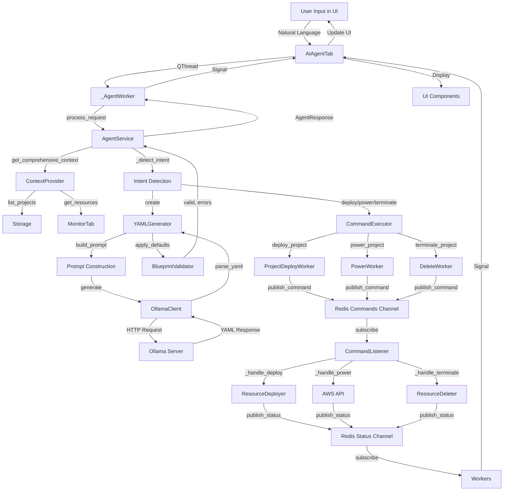

# Pockitect AI Agent Architecture - Comprehensive Assessment

## Executive Summary

The Pockitect MVP application features a sophisticated AI agent system that enables natural language interaction for AWS infrastructure management. The agent architecture follows a modular, event-driven design that integrates seamlessly with the application's Redis-based command system. This document provides a comprehensive assessment of all AI-related aspects of the application.

---

## Table of Contents

1. [AI Agent Architecture Overview](#ai-agent-architecture-overview)
2. [Agent's Ability to Use App Commands](#agents-ability-to-use-app-commands)
3. [Agent's Ability to Generate Templates](#agents-ability-to-generate-templates)
4. [Data Flow: UI to Model and Back](#data-flow-ui-to-model-and-back)
5. [Model Location and Integration](#model-location-and-integration)
6. [Design Philosophy](#design-philosophy)
7. [Component Deep Dive](#component-deep-dive)
8. [Training Data and Model Fine-Tuning](#training-data-and-model-fine-tuning)
9. [Integration Points](#integration-points)
10. [Strengths and Recommendations](#strengths-and-recommendations)

---

## AI Agent Architecture Overview

### High-Level Architecture

The AI agent system is built as a modular package (`src/ai/`) that integrates with the main application through a dedicated UI tab. The architecture follows a service-oriented pattern with clear separation of concerns:

```
┌─────────────────────────────────────────────────────────────┐
│                    AI Agent Tab (UI)                        │
│                  (src/ai/agent_tab.py)                      │
└───────────────────────┬───────────────────────────────────┘
                         │
                         ▼
┌─────────────────────────────────────────────────────────────┐
│                  AgentService                               │
│              (src/ai/agent_service.py)                      │
│  ┌──────────────┐  ┌──────────────┐  ┌──────────────┐   │
│  │ Intent       │  │ YAML         │  │ Command      │   │
│  │ Detection    │  │ Generation   │  │ Execution     │   │
│  └──────────────┘  └──────────────┘  └──────────────┘   │
└─────────────────────────────────────────────────────────────┘
         │                    │                    │
         ▼                    ▼                    ▼
┌─────────────────┐  ┌─────────────────┐  ┌─────────────────┐
│ OllamaClient    │  │ ContextProvider │  │ CommandExecutor │
│ (LLM Interface)│  │ (State Builder) │  │ (Redis Bridge)  │
└─────────────────┘  └─────────────────┘  └─────────────────┘
         │                    │                    │
         ▼                    ▼                    ▼
    ┌─────────┐         ┌──────────┐         ┌──────────┐
    │ Ollama  │         │ Projects │         │  Redis   │
    │ Server  │         │ Storage  │         │ Commands │
    └─────────┘         └──────────┘         └──────────┘
```

### Core Components

1. **AgentService** (`src/ai/agent_service.py`): Central orchestrator that coordinates intent detection, YAML generation, and command execution
2. **OllamaClient** (`src/ai/ollama_client.py`): Wrapper for local LLM calls via Ollama
3. **YAMLGenerator** (`src/ai/yaml_generator.py`): Converts natural language to YAML blueprints
4. **ContextProvider** (`src/ai/context_provider.py`): Builds structured context from application state
5. **CommandExecutor** (`src/ai/command_executor.py`): Executes commands via Redis/Workers
6. **ProjectMatcher** (`src/ai/project_matcher.py`): Fuzzy matching for project names
7. **BlueprintValidator** (`src/ai/validator.py`): Validates generated blueprints

### Intent Types

The agent supports seven distinct intent types:

1. **create**: Generate new infrastructure blueprints from natural language
2. **deploy**: Deploy existing projects to AWS
3. **power**: Start/stop EC2 instances and RDS databases
4. **terminate**: Delete AWS resources (with confirmation)
5. **scan**: Trigger resource scanning across regions
6. **query**: List projects and show status
7. **unknown**: Fallback for unrecognized requests

---

## Agent's Ability to Use App Commands

### Command Execution Architecture

The agent integrates deeply with the application's command system through multiple layers:

#### 1. Intent Detection → Command Mapping

The `AgentService._detect_intent()` method uses keyword-based pattern matching to identify user intent:

```python
# Example: "deploy my blog project"
→ Intent: deploy, project_name: "blog"
→ Resolved via ProjectMatcher to actual project slug
→ CommandExecutor.deploy_project() called
```

#### 2. Command Execution Flow

```
User Input → Intent Detection → Command Resolution → Worker Execution → Redis → Listeners → AWS
```

**Detailed Flow:**

1. **User Input** (`agent_tab.py`):
   - User types natural language request
   - `AIAgentTab._on_send_clicked()` captures input
   - `_AgentWorker` runs in background thread

2. **Intent Processing** (`agent_service.py`):
   - `AgentService.process_request()` called
   - `_detect_intent()` identifies intent type
   - For non-create intents, resolves project names via `ProjectMatcher`

3. **Command Execution** (`agent_tab.py`):
   - For commands requiring confirmation (deploy, power, terminate):
     - `AgentResponse.requires_confirmation = True`
     - UI shows "Confirm & Execute" button
   - User confirms → `_on_confirm_execute()` called

4. **Worker Execution** (`agent_tab.py` + `workers.py`):
   - Deploy: `ProjectDeployWorker` (via `deploy_worker.py`)
   - Power: `PowerWorker` (via `workers.py`)
   - Terminate: `DeleteWorker` (via `workers.py`)
   - Scan: Direct call to `monitor_service.request_scan()`

5. **Redis Command Publishing** (`workers.py`):
   - Workers publish commands to `pockitect:commands` channel
   - Include `request_id` for tracking

6. **Command Processing** (`listeners.py`):
   - `CommandListener` subscribes to `pockitect:commands`
   - Dispatches to appropriate handler:
     - `_handle_deploy()` → `ResourceDeployer`
     - `_handle_power()` → Direct AWS API calls
     - `_handle_terminate()` → `ResourceDeleter` with dependency graph
     - `_handle_scan_all()` → `ResourceScanner`

7. **Status Updates** (`listeners.py`):
   - Status published to `pockitect:status` channel
   - Workers listen for status updates matching `request_id`
   - UI updates via Qt signals

### Supported Commands

| Intent | Command | Worker | Redis Handler | AWS Action |
|--------|---------|--------|---------------|------------|
| deploy | `deploy` | `ProjectDeployWorker` | `_handle_deploy()` | Creates EC2, VPC, RDS, S3 |
| power | `power` | `PowerWorker` | `_handle_power()` | Start/Stop EC2/RDS |
| terminate | `terminate` | `DeleteWorker` | `_handle_terminate()` | Delete resources (topological order) |
| scan | `scan_all_regions` | Direct call | `_handle_scan_all()` | Scan AWS regions |

### Command Safety Features

1. **Confirmation Required**: Destructive actions (deploy, power, terminate) require explicit user confirmation
2. **Project Matching**: Fuzzy matching prevents typos from executing on wrong projects
3. **Dependency Handling**: Termination uses topological sorting to delete resources in correct order
4. **Error Handling**: All commands include comprehensive error handling and status reporting

---

## Agent's Ability to Generate Templates

### YAML Generation Architecture

The agent generates infrastructure blueprints (templates) from natural language using a multi-stage process:

#### 1. Prompt Construction (`yaml_generator.py`)

The `YAMLGenerator._build_prompt()` method constructs a comprehensive prompt:

```python
prompt = (
    "Current AWS State:\n{resources_summary}\n\n"
    "Existing Projects:\n{projects_summary}\n\n"
    "Available Options:\n{aws_specs}\n\n"
    "YAML Schema:\n{schema_definition}\n\n"
    f'User Request: "{user_input}"\n\n'
    "Generate ONLY valid YAML matching the schema above. No explanations, just YAML."
)
```

**Context Components:**
- **Resources Summary**: Current AWS resources by region and project
- **Projects Summary**: List of existing projects with status
- **AWS Specs**: Valid regions, instance types, AMIs, DB engines, etc.
- **Schema Definition**: Complete YAML blueprint structure (from `create_empty_blueprint()`)

#### 2. LLM Generation (`ollama_client.py`)

The `OllamaClient.generate()` method calls the local Ollama server:

```python
response = self._client.chat(
    model=self.model,  # Default: "llama3.2"
    messages=[
        {"role": "system", "content": system_prompt},
        {"role": "user", "content": prompt},
    ],
)
```

**Configuration:**
- **Host**: `localhost` (configurable via `OLLAMA_HOST`)
- **Port**: `11434` (configurable via `OLLAMA_PORT`)
- **Model**: `llama3.2` (configurable via `OLLAMA_MODEL`)

#### 3. YAML Parsing (`yaml_generator.py`)

The response is parsed to extract YAML:

```python
# Handles code fences: ```yaml\n...\n```
fenced = re.findall(r"```(?:yaml)?\n(.*?)```", content, flags=re.DOTALL)
# Falls back to direct YAML parsing if no fences
parsed = yaml.safe_load(content)
```

#### 4. Default Application (`yaml_generator.py`)

Generated YAML is merged with defaults:

```python
base = create_empty_blueprint(name, description, region, owner)
merged = merge(base, blueprint)  # Deep merge with defaults
```

This ensures:
- Required fields are present
- Default values are applied
- Structure matches canonical blueprint format

#### 5. Validation (`validator.py`)

Generated blueprints are validated:

```python
validator = BlueprintValidator()
valid, errors = validator.validate(blueprint)
```

**Validation Checks:**
- Required sections: `project`, `network`, `compute`, `data`, `security`
- Valid regions (from `AWS_REGIONS`)
- Valid instance types (from `INSTANCE_TYPES`)
- Valid AMIs (from `COMMON_AMIS` or custom AMI IDs)
- Valid DB engines (from `DB_ENGINES`)
- Valid DB instance classes (from `DB_INSTANCE_CLASSES`)

### Template Generation Flow

```
User Input
    ↓
Context Building (ContextProvider)
    ↓
Prompt Construction (YAMLGenerator)
    ↓
LLM Generation (OllamaClient)
    ↓
YAML Parsing
    ↓
Default Merging
    ↓
Validation (BlueprintValidator)
    ↓
UI Display (agent_tab.py)
    ↓
Preview Dialog (preview_dialog.py)
    ↓
Save/Edit/Regenerate Options
```

### Template Quality Features

1. **Context-Aware**: Includes current AWS state and existing projects
2. **Schema-Guided**: Uses canonical blueprint structure as reference
3. **Validation**: Multi-level validation ensures correctness
4. **Error Recovery**: Validation errors shown in UI, regeneration available
5. **Edit Integration**: Generated templates can be opened in wizard for refinement

---

## Data Flow: UI to Model and Back

### Complete Data Flow Diagram



### Detailed Flow Stages

#### Stage 1: User Input → Intent Detection

**Location**: `src/ai/agent_tab.py` → `src/ai/agent_service.py`

1. User types in `AIAgentTab.input_edit` (QTextEdit)
2. "Send" button clicked → `_on_send_clicked()`
3. `_AgentWorker` created in QThread
4. `AgentService.process_request(user_input)` called
5. `_detect_intent()` analyzes input using keyword matching

**Data Transformation:**
```
"Create a t3.micro web server in us-east-1"
→ AgentIntent(type="create", confidence=0.9)
```

#### Stage 2: Context Building

**Location**: `src/ai/context_provider.py`

For "create" intents, context is built:

```python
context = {
    "resources_summary": "Resource counts by region: ...",
    "projects_summary": "Existing projects: ...",
    "aws_specs": {
        "regions": ["us-east-1", ...],
        "instance_types": ["t3.micro", ...],
        "amis": [...],
        "db_engines": [...],
        "db_instance_classes": [...]
    }
}
```

**Data Sources:**
- `list_projects()` → Existing projects
- `monitor_tab.resources` → Current AWS resources
- `wizard.pages.*` → Valid AWS options

#### Stage 3: YAML Generation

**Location**: `src/ai/yaml_generator.py` → `src/ai/ollama_client.py`

1. Prompt constructed with context and schema
2. `OllamaClient.generate()` sends HTTP request to Ollama
3. Ollama processes prompt and returns YAML
4. Response parsed (handles code fences)
5. YAML merged with defaults
6. Validated via `BlueprintValidator`

**Data Transformation:**
```
Natural Language → Prompt → LLM Response → Parsed YAML → Validated Blueprint
```

#### Stage 4: Response Handling

**Location**: `src/ai/agent_tab.py`

1. `AgentResponse` received in `_on_response_received()`
2. For "create" intents:
   - YAML displayed in `yaml_preview` (QTextEdit)
   - Validation errors shown in status
   - "Preview / Save" button enabled
3. For command intents:
   - Confirmation message displayed
   - "Confirm & Execute" button enabled

#### Stage 5: Command Execution (if confirmed)

**Location**: `src/ai/agent_tab.py` → `src/workers.py` → `src/app/core/listeners.py`

1. User clicks "Confirm & Execute"
2. Appropriate worker created (DeployWorker, PowerWorker, DeleteWorker)
3. Worker publishes command to Redis `pockitect:commands` channel
4. `CommandListener` receives command
5. Handler executes AWS operations
6. Status updates published to `pockitect:status` channel
7. Worker receives status updates
8. Qt signals update UI

**Data Flow:**
```
UI → Worker → Redis Commands → Listener → AWS API
                                    ↓
                              Redis Status ← Worker ← UI Update
```

### Data Structures

#### AgentIntent
```python
@dataclass
class AgentIntent:
    type: Literal["create", "deploy", "power", "terminate", "scan", "query", "unknown"]
    confidence: float
    project_name: Optional[str] = None
    action: Optional[str] = None  # For power: "start" or "stop"
    region: Optional[str] = None
    details: Dict[str, Any] = None
```

#### AgentResponse
```python
@dataclass
class AgentResponse:
    intent: AgentIntent
    blueprint: Optional[Dict[str, Any]] = None  # For create intent
    message: str = ""
    requires_confirmation: bool = False
    confirmation_details: Optional[Dict[str, Any]] = None
```

#### Blueprint Structure
```yaml
project:
  name: string
  description: string
  region: string
  created_at: ISO8601
  owner: string
network:
  vpc_id: string | null
  subnet_id: string | null
  security_group_id: string | null
  vpc_env: "dev" | "prod" | "default"
  subnet_type: "public" | "private"
  rules: [...]
compute:
  instance_type: string
  image_id: string
  image_name: string
  user_data: string
  instance_id: string | null
data:
  db: {...}
  s3_bucket: {...}
security:
  key_pair: {...}
  certificate: {...}
  iam_role: {...}
```

---

## Model Location and Integration

### Current Model Architecture

The application uses **Ollama** as the LLM runtime, which runs as a separate local service:

#### Model Configuration

**Location**: `src/app/core/config.py`

```python
OLLAMA_HOST = os.getenv("OLLAMA_HOST", "localhost")
OLLAMA_PORT = int(os.getenv("OLLAMA_PORT", 11434))
OLLAMA_MODEL = os.getenv("OLLAMA_MODEL", "llama3.2")
```

#### Model Integration Points

1. **OllamaClient** (`src/ai/ollama_client.py`):
   - Wraps Ollama Python client
   - Handles HTTP communication with Ollama server
   - Supports both `generate()` and `chat()` APIs

2. **Model Initialization**:
   - Model name configured via environment variable
   - Default: `llama3.2` (Llama 3.2)
   - Can be changed to any Ollama-compatible model

3. **Model Requirements**:
   - Ollama server must be running locally
   - Model must be pulled via `ollama pull llama3.2`
   - Server accessible at `http://localhost:11434`

### Where the Model Should Live

#### Current Approach: External Service (Ollama)

**Pros:**
- ✅ No model files in application directory
- ✅ Can switch models without code changes
- ✅ Supports fine-tuned models via Ollama
- ✅ Memory management handled by Ollama
- ✅ Can use GPU acceleration if available

**Cons:**
- ❌ Requires separate service running
- ❌ Network dependency (even if local)
- ❌ Additional setup step for users

#### Alternative Approaches

1. **Embedded Model** (Not Recommended):
   - Would require bundling model files (~GB)
   - Memory management complexity
   - Platform-specific binaries

2. **Cloud API** (Future Consideration):
   - OpenAI, Anthropic, etc.
   - Would require API keys
   - Network dependency
   - Cost per request

3. **Hybrid Approach** (Recommended):
   - Default to Ollama (local)
   - Optional cloud API fallback
   - User-configurable provider

### Model Fine-Tuning Support

The application includes comprehensive tooling for fine-tuning:

**Location**: `tools/` directory

1. **Training Data Generation** (`tools/generate_synthetic_training_data.py`):
   - Uses GPT-4/Claude to generate training examples
   - Creates prompt/YAML pairs
   - Stores in `data/training/`

2. **Training Data Format** (`data/training/`):
   - 70+ example pairs (`.prompt.txt` + `.json`)
   - Diverse scenarios (blog, API, ML, etc.)
   - Validated against blueprint schema

3. **Format Conversion** (`tools/convert_to_finetuning_format.py`):
   - Converts to Unsloth format (LoRA fine-tuning)
   - Converts to Ollama Modelfile format
   - Supports Alpaca and ChatML formats

4. **Fine-Tuning Workflow**:
   ```
   Generate Training Data → Validate → Convert Format → Fine-Tune → Use in Ollama
   ```

### Model Deployment Recommendations

1. **Development**: Use Ollama with default `llama3.2`
2. **Production**: Fine-tune model on Pockitect-specific data
3. **Distribution**: Provide Ollama Modelfile for easy deployment
4. **Documentation**: Include setup instructions for Ollama

---

## Design Philosophy

### Core Design Principles

#### 1. **Modularity and Separation of Concerns**

Each component has a single, well-defined responsibility:

- **AgentService**: Orchestration only
- **OllamaClient**: LLM communication only
- **YAMLGenerator**: Template generation only
- **CommandExecutor**: Command execution only
- **ContextProvider**: State aggregation only

**Benefit**: Easy to test, maintain, and extend.

#### 2. **Event-Driven Architecture**

The agent integrates with the application's Redis-based event system:

- Commands published to Redis channels
- Status updates via pub/sub
- Non-blocking UI updates
- Background processing

**Benefit**: Scalable, responsive UI, clear separation of concerns.

#### 3. **Safety-First Approach**

Multiple layers of safety:

- **Confirmation Required**: Destructive actions require explicit confirmation
- **Validation**: Generated blueprints validated before use
- **Project Matching**: Fuzzy matching prevents typos
- **Error Handling**: Comprehensive error handling at all levels

**Benefit**: Prevents accidental resource deletion, ensures correctness.

#### 4. **Progressive Enhancement**

The agent enhances rather than replaces existing functionality:

- Wizard still available for manual configuration
- Generated templates can be edited in wizard
- Commands can be executed manually
- Agent is optional feature

**Benefit**: Users can choose their preferred workflow.

#### 5. **Local-First Philosophy**

- Uses local Ollama server (no cloud dependency)
- All data stored locally
- No external API keys required (for basic use)
- Privacy-preserving

**Benefit**: Works offline, no data leaves user's machine.

#### 6. **Context-Aware Intelligence**

The agent uses rich context:

- Current AWS resources
- Existing projects
- Valid AWS options
- User's infrastructure patterns

**Benefit**: More accurate, relevant suggestions.

### Architectural Patterns

#### 1. **Service Layer Pattern**

```
UI Layer (agent_tab.py)
    ↓
Service Layer (agent_service.py)
    ↓
Domain Layer (yaml_generator.py, command_executor.py)
    ↓
Infrastructure Layer (ollama_client.py, redis_client.py)
```

#### 2. **Strategy Pattern**

Intent detection uses strategy-like pattern:
- Different intents → Different handlers
- Extensible for new intent types

#### 3. **Observer Pattern**

Qt signals for UI updates:
- Workers emit signals
- UI components observe and update

#### 4. **Factory Pattern**

Workers created based on intent:
- `ProjectDeployWorker` for deploy
- `PowerWorker` for power
- `DeleteWorker` for terminate

### Design Trade-offs

#### 1. **Keyword Matching vs. LLM-Based Intent Detection**

**Current**: Keyword-based pattern matching
**Trade-off**: Fast but less flexible

**Future Consideration**: Use LLM for intent detection
- More flexible
- Better handling of variations
- Slower (additional LLM call)

#### 2. **Local LLM vs. Cloud API**

**Current**: Local Ollama
**Trade-off**: Requires setup but privacy-preserving

**Future Consideration**: Support cloud APIs as option
- Easier setup
- Better models available
- Requires API keys, network

#### 3. **Synchronous vs. Asynchronous Processing**

**Current**: Background threads for LLM calls
**Trade-off**: Non-blocking UI but more complex

**Alternative**: Synchronous (simpler but blocks UI)

---

## Component Deep Dive

### AgentService (`src/ai/agent_service.py`)

**Purpose**: Central orchestrator for all agent functionality

**Key Methods:**
- `process_request(user_input: str) -> AgentResponse`: Main entry point
- `_detect_intent(user_input: str) -> AgentIntent`: Intent detection
- `_extract_project_name(text: str) -> Optional[str]`: Project name extraction
- `_extract_region(text: str) -> Optional[str]`: Region extraction
- `_resolve_project(project_name, user_input) -> Optional[str]`: Project resolution

**Dependencies:**
- `OllamaClient`: For LLM calls (indirect via YAMLGenerator)
- `ContextProvider`: For context building
- `YAMLGenerator`: For template generation
- `CommandExecutor`: For command execution
- `ProjectMatcher`: For project name matching

**Design Decisions:**
- Intent detection is keyword-based (fast, deterministic)
- Defaults to "create" intent if unclear (safest assumption)
- Project name extraction uses regex patterns

### OllamaClient (`src/ai/ollama_client.py`)

**Purpose**: Wrapper for Ollama LLM communication

**Key Methods:**
- `generate(prompt: str, system_prompt: Optional[str]) -> str`: Generate completion
- `_ensure_client()`: Lazy initialization of Ollama client

**Configuration:**
- Host, port, model configurable via environment variables
- Defaults: `localhost:11434`, model `llama3.2`

**Error Handling:**
- Raises `RuntimeError` if Ollama package not installed
- Logs errors but re-raises exceptions

**Design Decisions:**
- Lazy client initialization (only when needed)
- Supports both `generate()` and `chat()` APIs
- System prompt optional (for flexibility)

### YAMLGenerator (`src/ai/yaml_generator.py`)

**Purpose**: Converts natural language to YAML blueprints

**Key Methods:**
- `generate_blueprint(user_input: str, context: Dict) -> Dict`: Main generation method
- `_build_prompt(user_input: str, context: Dict) -> str`: Prompt construction
- `_schema_definition() -> str`: Schema extraction
- `_parse_yaml_from_response(response: str) -> Dict`: YAML parsing
- `_apply_defaults(blueprint: Dict) -> Dict`: Default merging

**Prompt Structure:**
1. Current AWS state
2. Existing projects
3. Available AWS options
4. YAML schema
5. User request
6. Generation instructions

**Design Decisions:**
- Uses canonical blueprint as schema reference
- Handles code fences in LLM response
- Deep merges with defaults to ensure completeness
- Raises `ValueError` if YAML parsing fails

### ContextProvider (`src/ai/context_provider.py`)

**Purpose**: Builds structured context for LLM prompts

**Key Methods:**
- `get_resources_summary() -> str`: AWS resources summary
- `get_projects_summary() -> str`: Projects list
- `get_aws_specs() -> Dict`: Valid AWS options
- `get_comprehensive_context() -> Dict`: Complete context

**Data Sources:**
- `monitor_tab.resources`: Current AWS resources
- `list_projects()`: Existing projects
- `wizard.pages.*`: Valid AWS options (regions, instance types, etc.)

**Design Decisions:**
- Aggregates data from multiple sources
- Formats as human-readable strings for LLM
- Caches nothing (always fresh data)

### CommandExecutor (`src/ai/command_executor.py`)

**Purpose**: Executes commands via Redis/Workers

**Key Methods:**
- `deploy_project(...) -> ProjectDeployWorker`: Deploy a project
- `power_project(...) -> PowerWorker`: Start/stop resources
- `terminate_project(...) -> DeleteWorker`: Delete resources
- `scan_regions(...)`: Trigger resource scan

**Design Decisions:**
- Returns worker instances (already started)
- Supports callbacks for progress/finished events
- Falls back to Redis direct publish if monitor_service unavailable

### ProjectMatcher (`src/ai/project_matcher.py`)

**Purpose**: Fuzzy matching for project names

**Key Methods:**
- `find_project(user_input: str) -> Optional[Dict]`: Find matching project
- `load_project_by_name(project_name: str) -> Optional[Dict]`: Load blueprint

**Matching Strategy:**
1. Exact match on name or slug
2. Fuzzy match using `SequenceMatcher`
3. Bonus for substring matches
4. Threshold: 0.6 similarity

**Design Decisions:**
- Refreshes cache on each call (always up-to-date)
- Uses `difflib.SequenceMatcher` for fuzzy matching
- Returns `None` if no match found

### BlueprintValidator (`src/ai/validator.py`)

**Purpose**: Validates generated blueprints

**Key Methods:**
- `validate(blueprint: Dict) -> Tuple[bool, List[str]]`: Validate blueprint
- `fix_common_issues(blueprint: Dict) -> Dict`: Apply fixes

**Validation Rules:**
- Required sections present
- Valid regions (from `AWS_REGIONS`)
- Valid instance types (from `INSTANCE_TYPES`)
- Valid AMIs (from `COMMON_AMIS` or custom)
- Valid DB engines/classes

**Design Decisions:**
- Returns list of errors (not just boolean)
- Uses sets for fast lookup
- Allows custom AMI IDs (starts with "ami-")

---

## Training Data and Model Fine-Tuning

### Training Data Structure

**Location**: `data/training/`

**Format**: Paired files
- `NNN-name.prompt.txt`: Natural language prompt
- `NNN-name.json`: Corresponding YAML blueprint (as JSON)

**Current Dataset**: 70+ examples covering:
- Simple blogs
- API servers
- Full-stack applications
- ML training servers
- E-commerce backends
- Monitoring stacks
- Game servers
- And many more...

### Training Data Generation

**Tool**: `tools/generate_synthetic_training_data.py`

**Features:**
- Uses GPT-4 or Claude API
- Generates diverse examples automatically
- Varies scenarios and phrasing
- Cost: ~$0.01-0.03 per example

**Usage:**
```bash
python tools/generate_synthetic_training_data.py --count 50 --provider openai
```

### Fine-Tuning Formats

**Tool**: `tools/convert_to_finetuning_format.py`

**Supported Formats:**
1. **Unsloth** (Recommended): JSONL for LoRA fine-tuning
2. **Ollama Modelfile**: For Ollama fine-tuning
3. **Alpaca**: Instruction format
4. **ChatML**: Message format

**Usage:**
```bash
python tools/convert_to_finetuning_format.py --format unsloth
```

### Fine-Tuning Workflow

1. **Generate Training Data**:
   ```bash
   python tools/generate_synthetic_training_data.py --count 100 --provider openai
   ```

2. **Validate Data**:
   ```bash
   python tools/validate_training_data.py
   ```

3. **Convert Format**:
   ```bash
   python tools/convert_to_finetuning_format.py --format unsloth
   ```

4. **Fine-Tune Model**:
   - Use Unsloth for LoRA fine-tuning
   - Or use Ollama Modelfile format

5. **Deploy Fine-Tuned Model**:
   - Load in Ollama
   - Update `OLLAMA_MODEL` environment variable

### Model Improvement Strategy

1. **Collect Real User Prompts**: Log successful generations
2. **Expand Training Data**: Add edge cases and variations
3. **Fine-Tune Iteratively**: Improve model on specific failures
4. **A/B Testing**: Compare fine-tuned vs. base model

---

## Integration Points

### UI Integration

**Location**: `src/main.py`

```python
self.tabs.addTab(AIAgentTab(monitor_tab=self.monitor_tab), "🤖 AI Agent")
```

**Integration Points:**
- `monitor_tab`: Provides resource data for context
- Shares same Redis event system
- Uses same project storage

### Command System Integration

**Location**: `src/app/core/listeners.py`

The agent uses the same command system as the rest of the application:

- Commands published to `pockitect:commands`
- Status updates from `pockitect:status`
- Same handlers for deploy, power, terminate, scan

### Storage Integration

**Location**: `src/storage.py`

The agent uses the same storage system:

- `list_projects()`: List existing projects
- `load_project(slug)`: Load project blueprints
- `save_project(blueprint)`: Save generated blueprints

### Wizard Integration

**Location**: `src/ai/preview_dialog.py`

Generated templates can be opened in the wizard:

```python
wizard = InfrastructureWizard(self)
wizard.project_page.set_data(project)
wizard.compute_page.set_data(compute)
# ... etc
```

**Benefit**: Users can refine AI-generated templates manually.

---

## Strengths and Recommendations

### Strengths

1. **Modular Architecture**: Clean separation of concerns, easy to test and extend
2. **Safety Features**: Confirmation required, validation, error handling
3. **Context-Aware**: Uses rich context for better generation
4. **Integration**: Seamlessly integrates with existing command system
5. **Local-First**: Privacy-preserving, works offline
6. **Fine-Tuning Support**: Comprehensive tooling for model improvement
7. **Progressive Enhancement**: Enhances rather than replaces existing features

### Areas for Improvement

#### 1. Intent Detection

**Current**: Keyword-based pattern matching
**Recommendation**: Add LLM-based intent detection

**Benefits:**
- Better handling of variations
- More natural language understanding
- Can handle complex queries

**Implementation:**
- Add `LLMIntentDetector` class
- Use lightweight model for intent detection
- Fall back to keyword matching if LLM unavailable

#### 2. Error Recovery

**Current**: Shows validation errors, allows regeneration
**Recommendation**: Add automatic error fixing

**Benefits:**
- Better user experience
- Fewer regeneration cycles
- More successful generations

**Implementation:**
- Use LLM to fix validation errors
- Apply fixes automatically
- Show fixed version to user

#### 3. Context Caching

**Current**: Context rebuilt on every request
**Recommendation**: Cache context with invalidation

**Benefits:**
- Faster response times
- Reduced load on storage/monitor
- Better scalability

**Implementation:**
- Cache context with TTL
- Invalidate on project/resource changes
- Use Redis for distributed caching

#### 4. Streaming Responses

**Current**: Waits for complete response
**Recommendation**: Stream LLM responses

**Benefits:**
- Perceived faster response
- Better user experience
- Can show progress

**Implementation:**
- Use Ollama streaming API
- Update UI as tokens arrive
- Handle partial YAML parsing

#### 5. Multi-Turn Conversations

**Current**: Single-turn interactions
**Recommendation**: Support conversation history

**Benefits:**
- Can refine requests
- Better context understanding
- More natural interaction

**Implementation:**
- Maintain conversation history
- Include in LLM context
- Allow "regenerate" with modifications

#### 6. Model Selection UI

**Current**: Model configured via environment variable
**Recommendation**: Add UI for model selection

**Benefits:**
- Easier configuration
- Can switch models without restart
- Better user experience

**Implementation:**
- Add model selector in settings
- List available Ollama models
- Update `OllamaClient` dynamically

#### 7. Cloud API Support

**Current**: Local Ollama only
**Recommendation**: Add optional cloud API support

**Benefits:**
- Better models available
- No local setup required
- Can use as fallback

**Implementation:**
- Add `CloudLLMClient` class
- Support OpenAI, Anthropic APIs
- User-configurable provider

### Priority Recommendations

1. **High Priority**: LLM-based intent detection
2. **High Priority**: Error recovery/automatic fixing
3. **Medium Priority**: Context caching
4. **Medium Priority**: Streaming responses
5. **Low Priority**: Multi-turn conversations
6. **Low Priority**: Model selection UI
7. **Low Priority**: Cloud API support

---

## Conclusion

The Pockitect AI agent architecture is well-designed with clear separation of concerns, comprehensive safety features, and seamless integration with the application's command system. The modular design makes it easy to extend and improve, while the local-first approach ensures privacy and offline functionality.

The agent successfully bridges natural language and infrastructure management, providing a powerful interface for AWS resource management. With the comprehensive training data and fine-tuning tooling, the system is well-positioned for continuous improvement.

Key strengths include:
- Modular, testable architecture
- Safety-first design
- Rich context awareness
- Seamless integration
- Fine-tuning support

Areas for future enhancement focus on improving intent detection, error recovery, and user experience through streaming and multi-turn conversations.

---

## Appendix: File Reference

### Core AI Agent Files

- `src/ai/agent_service.py`: Main orchestrator
- `src/ai/agent_tab.py`: UI component
- `src/ai/ollama_client.py`: LLM client wrapper
- `src/ai/yaml_generator.py`: Template generation
- `src/ai/context_provider.py`: Context building
- `src/ai/command_executor.py`: Command execution
- `src/ai/project_matcher.py`: Project name matching
- `src/ai/validator.py`: Blueprint validation
- `src/ai/preview_dialog.py`: YAML preview UI

### Integration Files

- `src/main.py`: Main application (adds AI tab)
- `src/app/core/listeners.py`: Command processing
- `src/app/core/redis_client.py`: Redis communication
- `src/workers.py`: Command workers
- `src/deploy_worker.py`: Deployment worker
- `src/storage.py`: Project storage

### Configuration

- `src/app/core/config.py`: Ollama configuration

### Training Tools

- `tools/generate_synthetic_training_data.py`: Training data generation
- `tools/convert_to_finetuning_format.py`: Format conversion
- `tools/validate_training_data.py`: Data validation
- `data/training/`: Training examples

---

*Document generated: 2026-01-18*
*Application Version: MVP*
*Architecture Version: 1.0*
