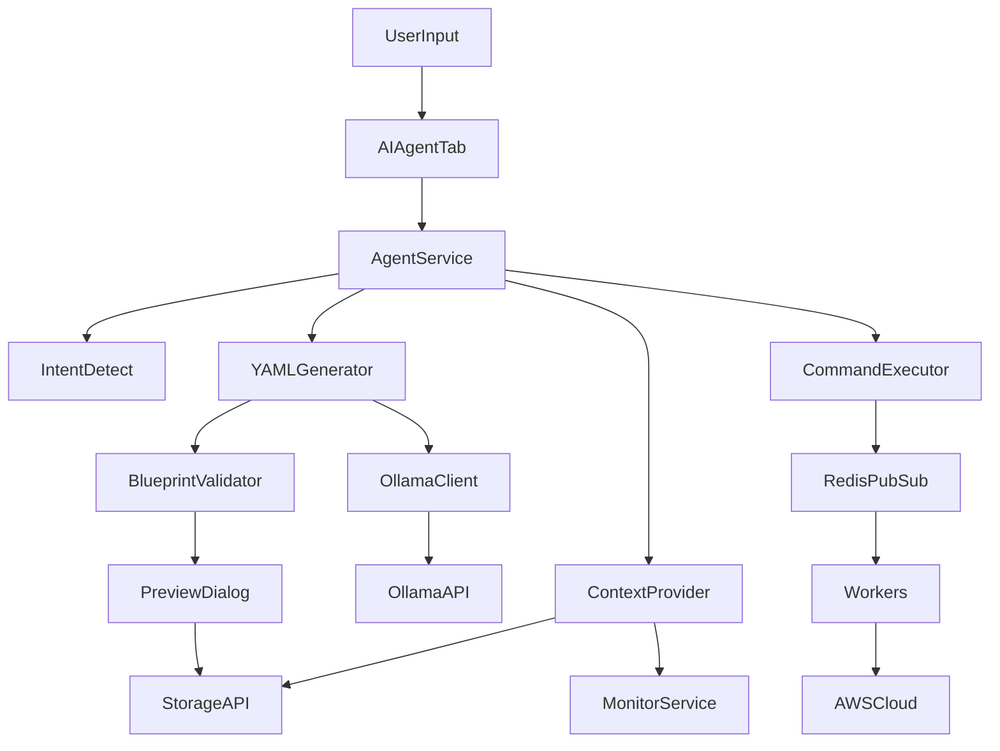
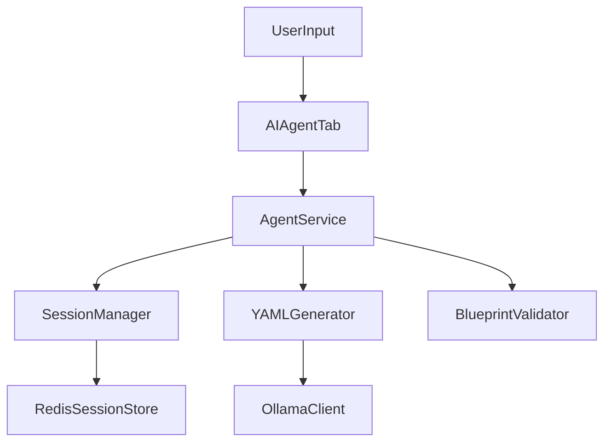

# AI Integration Guide

This document describes the AI agent integration for Pockitect, including setup, usage, and fine-tuning.

## Architecture Overview



## Components

- `src/ai/ollama_client.py`: Wrapper for local LLM calls.
- `src/ai/context_provider.py`: Aggregates AWS/project context.
- `src/ai/yaml_generator.py`: Prompting, parsing, defaults, validation.
- `src/ai/validator.py`: Schema validation helpers.
- `src/ai/project_matcher.py`: Fuzzy project lookup.
- `src/ai/command_executor.py`: Redis command execution.
- `src/ai/agent_service.py`: Intent detection + orchestration.
- `src/ai/agent_tab.py`: UI integration and user workflow.
- `src/ai/preview_dialog.py`: YAML preview and save/edit.

## Setup

1. Install and start Redis.
2. Install Ollama and pull a model:
   - `ollama pull llama3.2`
3. Install Python dependencies:
   - `pip install -r requirements.txt`
4. Launch the app:
   - `./run.sh`

## Usage

Open the **AI Agent** tab and send a request:

- "Create a t3.micro Ubuntu web server in us-east-1"
- "Deploy the blog-backend project"
- "Stop the demo project"
- "List all my projects"

If the request generates a blueprint, use **Preview / Save** to review and save it. If it triggers an action, use **Confirm & Execute** to proceed.

## Fine-Tuning Workflow

1. Generate training data:
   - `python tools/generate_synthetic_training_data.py --count 50`
2. Generate vague/ambiguous training data:
   - `python tools/generate_vague_training_data.py --count 50`
3. Validate training data:
   - `python tools/validate_training_data.py`
4. Convert to Unsloth format:
   - `python tools/convert_to_finetuning_format.py --format unsloth`
5. Fine-tune using Unsloth:
   - `python tools/finetune_model.py --model llama3.2 --train data/finetuning/train_unsloth.jsonl`
6. Load the generated Modelfile into Ollama:
   - `ollama create pockitect-ai -f data/finetuning/output/Modelfile`

## Vague and Multi-Turn Training Data

The vague training generator creates ambiguous prompts that require defaults and inference:

```bash
python tools/generate_vague_training_data.py --count 50
```

Some prompts include tool simulation and history blocks for multi-turn refinement:

```
[tool_simulation]
ContextProvider.get_projects_summary -> No projects found.
ContextProvider.get_aws_specs -> using defaults for region/instance.
[/tool_simulation]

[history]
User: Create a small blog backend.
Assistant: Generated a t3.small blog blueprint.
[/history]
Make it bigger and add a database.
```

The conversion tool automatically embeds these blocks into the fine-tuning instruction.

## Multi-Turn Refinement Flow



### Session Behavior

- Each AI tab starts a new session with a UUID.
- Up to 5 turns are kept in Redis (`ai:session:<id>`).
- Use **New Session** to clear history and start fresh.

## Troubleshooting

- **Ollama not reachable**: Ensure `ollama serve` is running and `OLLAMA_HOST`/`OLLAMA_PORT` are correct.
- **Invalid YAML responses**: Check prompts and ensure the model supports structured output.
- **Fine-tuning errors**: Verify Unsloth dependencies and GPU availability.
- **Redis errors**: Ensure Redis is running and `REDIS_HOST`/`REDIS_PORT` are correct.
