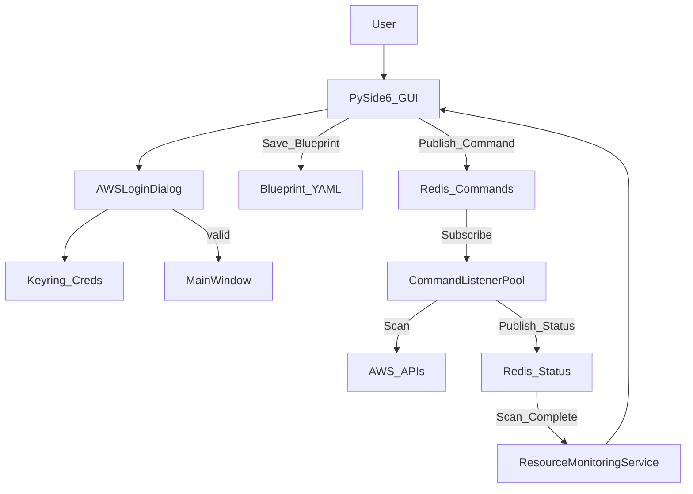
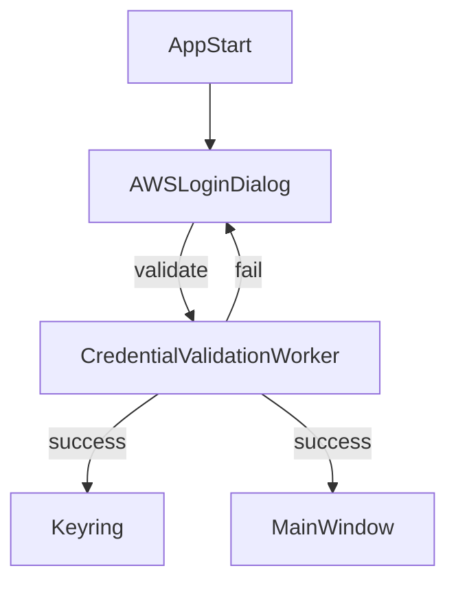
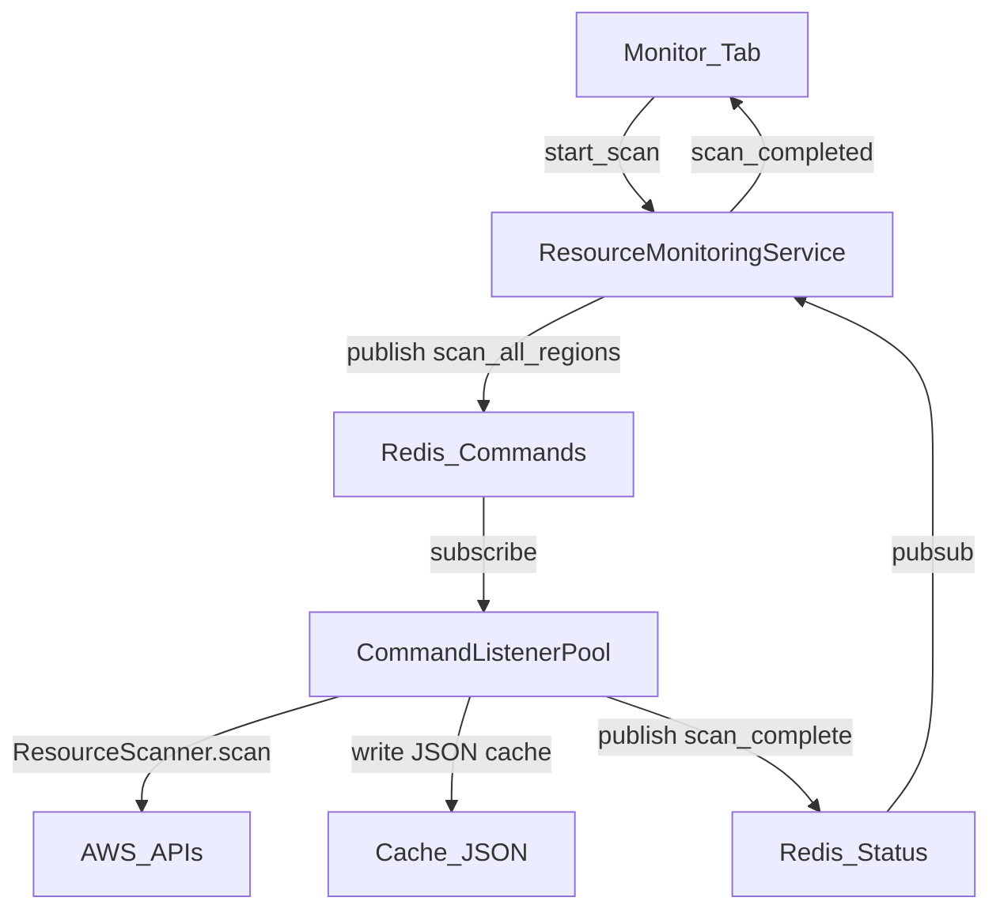
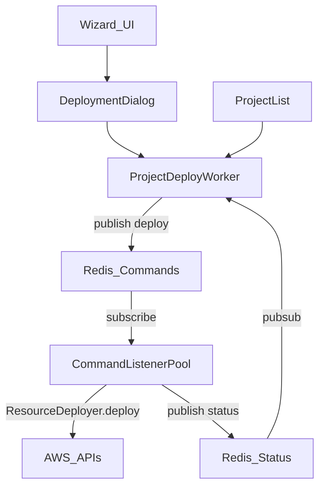
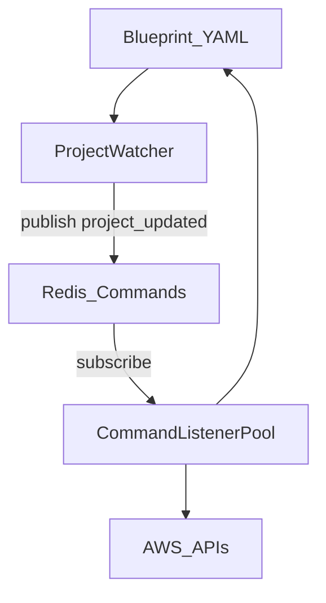

# Pockitect MVP Architecture Rundown

This document explains how the application is architected, how data flows, the architectural style, and the design philosophy. It focuses on current code paths and calls out wiring points that can cause debugging confusion.

## Executive Overview

Pockitect is a desktop-first, local-first infrastructure wizard built with PySide6. It has two primary domains:

- **Project lifecycle**: create/edit local blueprints and deploy resources.
- **Resource monitoring**: scan AWS across regions and present a live view of infrastructure.

The system is a hybrid of:

- **Desktop UI (Qt widgets + signals/slots)** for interaction and orchestration.
- **Event-driven background processing** using Redis pub/sub and listener threads.
- **Local-first persistence** with YAML blueprints stored on disk.

The main wiring is centralized in `src/main.py` and coordinated by background threads that bridge the UI and backend services.

## Architectural Style

- **Desktop UI shell**: PySide6 widgets, dialogs, and wizard pages.
- **Local-first persistence**: YAML blueprints in `data/projects` via `src/storage.py`.
- **Async/background execution**: Redis pub/sub in `src/app/core/redis_client.py` and command listeners in `src/app/core/listeners.py`.
- **AWS integration**: boto3 sessions built from keyring or default credential chain (`src/app/core/aws/credentials_helper.py`).

## Component Map

### UI Layer (PySide6)

- **App entry + tab layout**: `src/main.py`
- **Projects list + actions**: `src/main.py`, `src/project_row.py`
- **Wizard flow**: `src/wizard/wizard.py`, `src/wizard/pages/*`
- **Deployment dialog**: `src/wizard/deploy_dialog.py`
- **Monitor tab**: `src/monitor_tab.py`
- **Auth gate**: `src/auth_dialog.py`

### Background Services

- **Resource monitoring thread**: `src/monitor_service.py`
- **Command listeners**: `src/app/core/listeners.py`
- **Redis client + pubsub**: `src/app/core/redis_client.py`
- **Redis event stream**: `RedisClient.iter_events` shared by UI services and workers

### AWS Integration

- **Scanner**: `src/app/core/aws/scanner.py`
- **Deployer**: `src/app/core/aws/deployer.py` (orchestrates via `AWSResourceManager`)
- **Resource management & deletion**: `src/app/core/aws/resources.py`, `src/app/core/aws/recursive_deleter.py`
- **Resource tracking**: `src/app/core/aws/resource_tracker.py`
- **Credential helper**: `src/app/core/aws/credentials_helper.py`

### Persistence + Watching

- **Blueprints**: `src/storage.py`
- **Project watcher + refresher**: `src/watcher.py`

## High-Level System Flow

## Data Flows

### 1) Authentication Gate

**Goal**: block access until AWS credentials are validated.

1. `AWSLoginDialog` opens before the main window (`src/main.py`).
2. `CredentialValidationWorker` validates via STS, S3, and EC2 calls (`src/auth_dialog.py`).
3. Credentials are stored in keyring (if available).
4. AWS service calls use keyring credentials via `get_session()` (`src/app/core/aws/credentials_helper.py`).

Key files: `src/auth_dialog.py`, `src/app/core/aws/credentials_helper.py`

### 2) Project Creation and Persistence

**Goal**: the wizard produces a local blueprint stored on disk.

1. Wizard collects input across pages (`src/wizard/wizard.py`).
2. Blueprint is built and saved via `save_project()` (`src/storage.py`).
3. Files are stored as YAML in `data/projects`.

Key files: `src/wizard/wizard.py`, `src/storage.py`

### 3) Resource Monitoring / Scanning

**Goal**: scan all AWS regions asynchronously and update the UI.

1. User clicks “Scan All Regions” (`src/monitor_tab.py`).
2. `ResourceMonitoringService` publishes `scan_all_regions` to `pockitect:commands` (`src/monitor_service.py`).
3. Listener uses `ResourceScanner` to scan and writes per-region JSON caches (`data/cache/<region>.json`).
4. Listener publishes `scan_chunk` and `scan_complete` to `pockitect:status`.
5. Monitoring service loads JSON chunks and emits the full list to the UI.

Key files: `src/monitor_service.py`, `src/app/core/listeners.py`, `src/app/core/aws/scanner.py`, `src/app/core/redis_client.py`

### 4) Deployment (Wizard + Project List)

**Goal**: deploy from a blueprint via Redis commands and report progress back to the UI.

There are two entry points, but they converge on the same pipeline:

- **Wizard**: `DeploymentDialog` starts `ProjectDeployWorker` (`src/wizard/deploy_dialog.py`).
- **Project list**: `ProjectListWidget._deploy_project()` starts `ProjectDeployWorker` (`src/main.py`).

Shared flow:

1. `ProjectDeployWorker` maps the blueprint to a deployment template (`src/deploy_worker.py`).
2. Worker publishes `deploy` command with the template path.
3. Listener uses `ResourceDeployer` to create resources (`src/app/core/aws/deployer.py`).
4. Progress is published to `pockitect:status`.
5. `ProjectDeployWorker` listens to status updates and updates the UI.

Key files: `src/deploy_worker.py`, `src/app/core/listeners.py`, `src/app/core/aws/deployer.py`, `src/wizard/deploy_dialog.py`, `src/main.py`

### 5) Delete / Terminate

**Goal**: delete resources with dependency-aware ordering.

1. User selects resources in Monitor tab and clicks Delete.
2. Monitor tab publishes `terminate` command with selected resources.
3. Listener builds a dependency graph and deletes resources in reverse topological order.

Key files: `src/monitor_tab.py`, `src/app/core/listeners.py`, `src/app/core/aws/deleter.py`

### 6) Power Start/Stop

**Goal**: start/stop resources tagged with the project name.

1. Project list action starts `PowerWorker` (`src/workers.py`).
2. Worker publishes `power` command; listener performs boto3 start/stop with `get_session()`.

Key files: `src/workers.py`, `src/app/core/listeners.py`, `src/app/core/aws/credentials_helper.py`

### 7) Status Refresh / Watcher

**Goal**: refresh project status on file events and update blueprints.

1. `ProjectWatcher` listens for filesystem events in `data/projects` (`src/watcher.py`).
2. Watcher publishes `project_updated` command.
3. Listener uses `AWSResourceManager` to update state and writes YAML (`src/app/core/aws/resources.py`).

Key files: `src/watcher.py`, `src/app/core/listeners.py`, `src/app/core/aws/resources.py`, `src/storage.py`

## Persistence Model

- **Project blueprints**: YAML files in `data/projects` (`src/storage.py`).
- **Scan cache**: JSON files in `data/cache` per region.
- **Logs**: `data/logs/pockitect.log` via `app.core.config.setup_logging()`.

## Concurrency Model

- **Qt threads**: `QThread` for UI background work (`ProjectDeployWorker`, `ResourceMonitoringService`).
- **Listener pool**: thread executor for command handlers (`src/app/core/listeners.py`).
- **Redis pub/sub**: decouples UI from background completion and progress updates.
- **asyncio + to_thread**: AWS deploy/scan steps run async while using sync boto3 under the hood.

## Design Philosophy

- **Secure credentials**: keyring-backed storage; no plaintext in files.
- **Local-first**: projects live as local YAML blueprints.
- **Responsive UI**: long-running AWS operations stay off the UI thread.
- **Safe-by-default**: confirmation dialogs for destructive actions.
- **Recoverability**: track resource IDs so partial failures can be cleaned up.

## Crossed Wires and Confusion Points

These are the highest-risk areas for debugging ambiguity.

1) **Blueprint format mismatch in docs vs implementation**
- `src/storage.py` stores YAML, but its module docstring still references JSON.
- This can lead to incorrect expectations about file extensions and contents.

2) **Credentials flow split**
- `app.core.aws.credentials_helper.get_session()` pulls from keyring and falls back to the default AWS credential chain.
- `auth_dialog.get_aws_credentials()` is used by workers and returns only keyring values (empty if keyring is unavailable).
- This means some code paths can authenticate while others fail, depending on keyring availability.

3) **Deployment mapping is lossy**
- `ProjectDeployWorker._map_blueprint_to_deployer_format()` only maps a subset of the wizard blueprint (VPC/Subnet/SG, EC2, S3).
- Database settings and several wizard fields are not sent to the deployer, so deployment may diverge from the blueprint.

4) **Deployment progress semantics**
- Progress comes solely from Redis status messages on `pockitect:status`.
- `ProjectDeployWorker` assumes those messages include step/total, but the deployer only publishes what it’s given; missing step/total results in indeterminate progress.

5) **Resource scan vs UI state**
- The monitor tab relies on Redis-cached scan results, not live AWS calls.
- If Redis is down or stale, the UI can show empty or outdated resources even though AWS has state.

6) **Watcher vs monitor sources**
- Project status updates come from `BackgroundRefresher` (AWSResourceManager) and can differ from monitor scan results.
- This is a “two sources of truth” problem: YAML file status vs Redis scan cache.

## Debugging Map (Start Here)

- **App startup/auth issues**: `src/main.py`, `src/auth_dialog.py`
- **Scan issues**: `src/monitor_service.py`, `src/app/core/listeners.py`, `src/app/core/aws/scanner.py`
- **Deployment issues**: `src/deploy_worker.py`, `src/app/core/listeners.py`, `src/app/core/aws/deployer.py`
- **Blueprint save/load issues**: `src/storage.py`
- **Watcher refresh issues**: `src/watcher.py`, `src/app/core/aws/resources.py`
- **Delete/power actions**: `src/workers.py`, `src/app/core/aws/recursive_deleter.py`

## Summary

Pockitect is a hybrid desktop + event-listener architecture: Qt for UI, Redis pub/sub with listener threads for long-running AWS operations, and local YAML for persistence. Debugging complexity comes from multiple data sources (scan caches vs YAML status) and split credential paths. Consolidating credential usage and tightening the blueprint-to-deployer mapping would reduce “crossed wires” and improve traceability.
